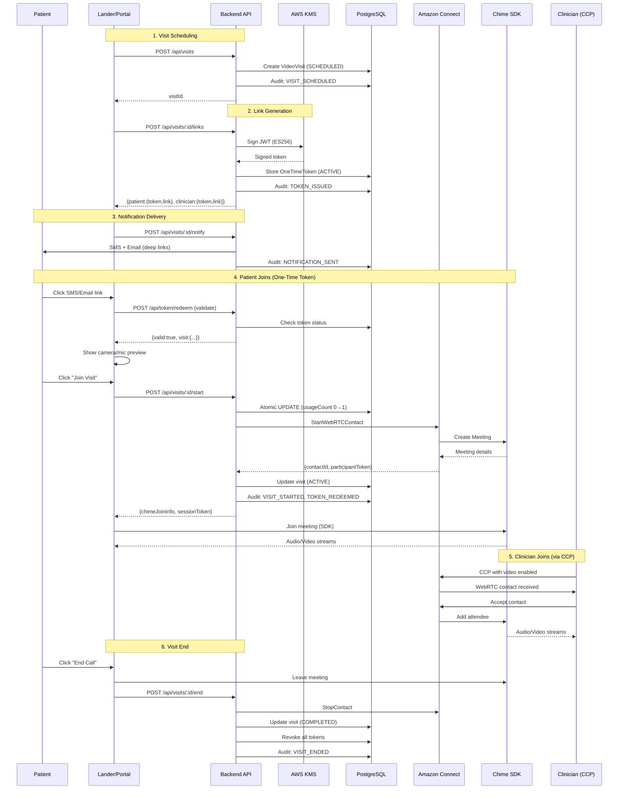

# 🎥 Video Visit System - Implementation Guide

## HIPAA/SOC2 Compliant Amazon Connect WebRTC + Chime SDK

**Status:** ✅ Backend Complete | 🔨 Frontend In Progress  
**Date:** September 29, 2025  
**Compliance:** HIPAA, SOC 2 Type II

---

## Architecture Overview



---

## Database Schema (HIPAA Compliant)

### VideoVisit Table
```sql
CREATE TABLE video_visits (
  id UUID PRIMARY KEY,
  patient_id UUID REFERENCES Patient(id),
  clinician_id UUID REFERENCES User(id),
  scheduled_at TIMESTAMP NOT NULL,
  duration INTEGER DEFAULT 30,
  status VideoVisitStatus DEFAULT 'SCHEDULED',
  started_at TIMESTAMP,
  ended_at TIMESTAMP,
  connect_contact_id TEXT UNIQUE,
  meeting_id TEXT UNIQUE,
  chief_complaint TEXT,  -- Encrypted via KMS
  clinical_notes TEXT,   -- Encrypted via KMS
  recording_enabled BOOLEAN DEFAULT false,
  recording_s3_key TEXT,
  created_at TIMESTAMP DEFAULT now(),
  updated_at TIMESTAMP DEFAULT now()
);

-- RLS Policy: Users can only see their own visits
CREATE POLICY video_visits_select_policy ON video_visits
  FOR SELECT USING (
    clinician_id::text = current_setting('rls.user_id', true)
    OR patient_id::text = current_setting('rls.patient_id', true)
    OR current_setting('rls.role', true) IN ('SUPER_ADMIN', 'ADMIN')
  );
```

### OneTimeToken Table
```sql
CREATE TABLE one_time_tokens (
  id UUID PRIMARY KEY,  -- JWT jti claim
  visit_id UUID REFERENCES video_visits(id) ON DELETE CASCADE,
  role TEXT NOT NULL,   -- patient|clinician
  status TokenStatus DEFAULT 'ACTIVE',
  nonce VARCHAR(64),
  issued_at TIMESTAMP,
  expires_at TIMESTAMP,
  redeemed_at TIMESTAMP,
  usage_count INTEGER DEFAULT 0,
  max_usage_count INTEGER DEFAULT 1,
  redemption_ip VARCHAR(45),
  redemption_ua TEXT,
  short_code VARCHAR(8) UNIQUE,
  created_at TIMESTAMP DEFAULT now()
);

-- Single-use enforcement via UPDATE WHERE usage_count = 0
```

### VideoAuditLog Table (Immutable)
```sql
CREATE TABLE video_audit_logs (
  id UUID PRIMARY KEY,
  event_type VideoAuditEventType,
  timestamp TIMESTAMP DEFAULT now(),
  visit_id UUID,
  token_id UUID,
  actor_id TEXT,
  actor_role TEXT,
  ip_address VARCHAR(45),
  user_agent TEXT,
  metadata JSONB,
  success BOOLEAN DEFAULT true,
  error_code TEXT,
  expires_at TIMESTAMP,  -- 7-year retention
  created_at TIMESTAMP DEFAULT now()
);

-- RLS Policy: No updates/deletes allowed (immutable)
CREATE POLICY video_audit_logs_no_update ON video_audit_logs
  FOR UPDATE USING (false);
CREATE POLICY video_audit_logs_no_delete ON video_audit_logs
  FOR DELETE USING (false);
```

---

## API Endpoints

### 1. Create Video Visit
```http
POST /api/visits
Content-Type: application/json
Authorization: Bearer <JWT>

{
  "patientId": "uuid",
  "clinicianId": "uuid",
  "scheduledAt": "2025-09-29T15:00:00Z",
  "duration": 30,
  "visitType": "initial",
  "chiefComplaint": "Headache for 3 days",
  "channel": "both"
}

Response 201:
{
  "visitId": "uuid",
  "status": "SCHEDULED",
  "scheduledAt": "2025-09-29T15:00:00Z",
  "expiresAt": "2025-09-30T15:00:00Z",
  "createdAt": "2025-09-29T14:00:00Z"
}
```

**Security:**
- Verifies clinician licensed in patient state
- Prevents double-booking
- Encrypts chief complaint before storage (KMS)

---

### 2. Generate Join Links
```http
POST /api/visits/:id/links
Content-Type: application/json
Authorization: Bearer <JWT>

{
  "roles": ["patient", "clinician"],
  "ttlMinutes": 20
}

Response 200:
{
  "patient": {
    "token": "eyJhbGc...",
    "link": "https://visit.eudaura.com/j/a1b2c3d4",
    "expiresAt": "2025-09-29T14:20:00Z",
    "tokenId": "uuid"
  },
  "clinician": {
    "token": "eyJhbGc...",
    "link": "https://visit.eudaura.com/j/e5f6g7h8",
    "expiresAt": "2025-09-29T14:20:00Z",
    "tokenId": "uuid"
  }
}
```

**Security:**
- JWT signed with KMS ES256 asymmetric key
- Short code (8 chars) for SMS-friendly links
- Single-use enforcement via DynamoDB conditional write
- IP + User-Agent binding on redemption

---

### 3. Send Notifications
```http
POST /api/visits/:id/notify
Content-Type: application/json
Authorization: Bearer <JWT>

{
  "channel": "both",
  "recipientRole": "both",
  "template": "initial"
}

Response 200:
{
  "sent": {
    "sms": {
      "messageId": "msg_123",
      "to": "***-***-1234",
      "status": "sent",
      "provider": "sns"
    },
    "email": {
      "messageId": "msg_456",
      "to": "j***@example.com",
      "status": "sent",
      "provider": "ses"
    }
  },
  "deliveryTracking": {
    "smsTrackingId": "track_123",
    "emailTrackingId": "track_456"
  }
}
```

**HIPAA Compliance:**
- No patient names in messages
- Only clinician first name (Dr. Jane)
- No diagnosis or chief complaint
- Delivery receipts tracked in audit logs

---

### 4. Validate Token (Pre-Join)
```http
POST /api/token/redeem
Content-Type: application/json

{
  "token": "eyJhbGc..."
}

Response 200:
{
  "valid": true,
  "visit": {
    "visitId": "uuid",
    "scheduledAt": "2025-09-29T15:00:00Z",
    "clinicianName": "Jane",
    "duration": 30
  },
  "expiresIn": 1140,
  "warnings": []
}

Response 410 (Expired):
{
  "valid": false,
  "error": "Token expired",
  "action": "REQUEST_NEW_LINK"
}

Response 409 (Already Used):
{
  "valid": false,
  "error": "Token already used",
  "action": "REQUEST_NEW_LINK"
}
```

**Security:**
- Read-only check (doesn't consume token)
- Clock skew tolerance: ±2 minutes
- Returns minimal info (no PHI)

---

### 5. Start Video Session
```http
POST /api/visits/:id/start
Content-Type: application/json

{
  "token": "eyJhbGc...",
  "deviceInfo": {
    "hasCamera": true,
    "hasMicrophone": true,
    "browser": "Chrome 119",
    "os": "macOS 14.0"
  }
}

Response 200:
{
  "connectContact": {
    "contactId": "contact_123",
    "instanceId": "instance_456",
    "participantId": "participant_789",
    "participantToken": "token_abc"
  },
  "chimeJoinInfo": {
    "meeting": {
      "meetingId": "meeting_123",
      "mediaPlacement": {
        "audioHostUrl": "https://...",
        "signalingUrl": "wss://...",
        ...
      }
    },
    "attendee": {
      "attendeeId": "attendee_123",
      "joinToken": "token_xyz"
    }
  },
  "visitSession": {
    "sessionToken": "session_token",
    "expiresIn": 3600
  }
}

Response 409 (Token Reused):
{
  "error": "TOKEN_REUSED",
  "message": "This link was already used",
  "action": "REQUEST_NEW_LINK"
}
```

**Security Flow:**
1. Validate JWT signature (KMS public key)
2. Atomic DynamoDB conditional write: `SET usage_count = usage_count + 1 WHERE usage_count = 0`
3. If write fails → token already redeemed (409 error)
4. Call Connect `StartWebRTCContact`
5. Return Chime join info + session token

---

### 6. End Video Session
```http
POST /api/visits/:id/end
Content-Type: application/json
Authorization: Bearer <SessionToken>

{
  "sessionToken": "session_token",
  "endReason": "completed",
  "duration": 1800,
  "notes": "Patient doing well, no follow-up needed"
}

Response 200:
{
  "visitId": "uuid",
  "status": "COMPLETED",
  "duration": 1800,
  "endedAt": "2025-09-29T15:30:00Z"
}
```

**Actions:**
- Updates visit status to COMPLETED
- Calls Connect `StopContact`
- Revokes all unused tokens
- Encrypts clinical notes (KMS)
- Creates audit log

---

## Security Controls

### Token Security (HIPAA Minimum Necessary)

**JWT Claims (ES256 Signed):**
```json
{
  "jti": "token-id-uuid",
  "iss": "telehealth-video-api",
  "aud": "video-visit",
  "exp": 1727646000,
  "nbf": 1727644680,
  "iat": 1727644800,
  "sub": "user-id-uuid",
  "visit_id": "visit-id-uuid",
  "role": "patient",
  "nonce": "64-char-hex"
}
```

**Single-Use Enforcement:**
```sql
-- Atomic conditional update
UPDATE one_time_tokens
SET usage_count = usage_count + 1,
    status = 'REDEEMED',
    redeemed_at = now(),
    redemption_ip = $1,
    redemption_ua = $2
WHERE id = $3
  AND status = 'ACTIVE'
  AND usage_count = 0;

-- If rowCount = 0, token was already redeemed
```

**IP + User-Agent Binding:**
- First redemption stores IP + UA
- Subsequent requests from different IP → rejected
- Prevents token sharing

---

### No PHI in URLs or Messages

**❌ WRONG (PHI exposed):**
```
https://visit.eudaura.com/join?
  patient=JohnDoe&
  diagnosis=Hypertension&
  phone=5551234567
```

**✅ CORRECT (Opaque token):**
```
https://visit.eudaura.com/j/a1b2c3d4
```

**Token decodes to (backend only):**
```json
{ "visit_id": "uuid", "role": "patient" }
```

**SMS Message (HIPAA Safe):**
```
Your video visit with Dr. Jane starts at 3:00 PM.
Tap to join: visit.eudaura.com/j/a1b2c3d4
Expires in 20 min. Reply HELP for support.
```

---

### Encryption Strategy

**At Rest:**
- Patient visit records → PostgreSQL (TLS + RDS encryption)
- Chief complaint → KMS envelope encryption before DB write
- Clinical notes → KMS envelope encryption
- Recordings (opt-in) → S3 with SSE-KMS, WORM (Object Lock)

**In Transit:**
- All API calls → TLS 1.2+
- WebRTC media → DTLS-SRTP (built into Chime SDK)
- Signaling → WSS (secure WebSocket)

**JWT Signing:**
- KMS asymmetric key (ECC_NIST_P256)
- ES256 algorithm
- Public key cached for verification

---

## Audit Logging (SOC 2)

### Events Logged

| Event | Trigger | Retention |
|-------|---------|-----------|
| `VISIT_SCHEDULED` | Visit created | 7 years |
| `TOKEN_ISSUED` | Link generated | 7 years |
| `TOKEN_REDEEMED` | Token used | 7 years |
| `TOKEN_EXPIRED` | Token TTL passed | 7 years |
| `NOTIFICATION_SENT` | SMS/Email sent | 7 years |
| `VISIT_STARTED` | Connect session started | 7 years |
| `VISIT_ENDED` | Call disconnected | 7 years |
| `LINK_RESENT` | New link requested | 7 years |

### Audit Log Fields

```typescript
{
  id: "uuid",
  event_type: "TOKEN_REDEEMED",
  timestamp: "2025-09-29T14:05:23Z",
  visit_id: "uuid",
  token_id: "uuid",
  actor_id: "user-id",
  actor_role: "PATIENT",
  ip_address: "203.0.113.45",
  user_agent: "Mozilla/5.0...",
  metadata: {
    device_info: {...},
    contact_id: "contact_123"
  },
  success: true,
  expires_at: "2032-09-29T14:05:23Z"  // 7-year retention
}
```

---

## Frontend Implementation

### Join Page (/j/[shortCode])

**File:** `apps/web/app/j/[shortCode]/page.tsx`

```typescript
'use client'

import { useEffect, useState } from 'react'
import { useParams, useRouter } from 'next/navigation'
import { VideoJoinClient } from '@/components/VideoJoinClient'

export default function JoinPage() {
  const { shortCode } = useParams()
  const [state, setState] = useState<'loading' | 'valid' | 'expired' | 'invalid'>('loading')
  const [visitInfo, setVisitInfo] = useState<any>(null)
  const [fullToken, setFullToken] = useState<string>('')

  useEffect(() => {
    async function validateToken() {
      try {
        // Resolve short code to full token
        const res = await fetch(`/api/token/resolve/${shortCode}`)
        const { token } = await res.json()
        setFullToken(token)

        // Validate token
        const validation = await fetch('/api/token/redeem', {
          method: 'POST',
          headers: { 'Content-Type': 'application/json' },
          body: JSON.stringify({ token })
        })

        const result = await validation.json()

        if (result.valid) {
          setState('valid')
          setVisitInfo(result.visit)
        } else if (result.action === 'REQUEST_NEW_LINK') {
          setState('expired')
        } else {
          setState('invalid')
        }
      } catch (error) {
        setState('invalid')
      }
    }

    validateToken()
  }, [shortCode])

  if (state === 'loading') {
    return <LoadingSpinner message="Verifying your visit link..." />
  }

  if (state === 'expired') {
    return <ExpiredLinkPage visitId={visitInfo?.visitId} />
  }

  if (state === 'invalid') {
    return <InvalidLinkPage />
  }

  return <VideoJoinClient token={fullToken} visitInfo={visitInfo} />
}
```

---

### Video Join Client Component

**File:** `apps/web/components/VideoJoinClient.tsx`

```typescript
'use client'

import { useState, useEffect, useRef } from 'react'
import {
  DefaultMeetingSession,
  DefaultDeviceController,
  MeetingSessionConfiguration,
  ConsoleLogger,
  LogLevel
} from 'amazon-chime-sdk-js'

export function VideoJoinClient({ token, visitInfo }) {
  const [step, setStep] = useState<'preview' | 'joining' | 'in-call' | 'ended'>('preview')
  const [devices, setDevices] = useState({ cameras: [], microphones: [], speakers: [] })
  const [selectedDevices, setSelectedDevices] = useState({ camera: '', microphone: '', speaker: '' })
  const [permissions, setPermissions] = useState({ camera: false, microphone: false })
  const [meetingSession, setMeetingSession] = useState<DefaultMeetingSession | null>(null)
  const localVideoRef = useRef<HTMLVideoElement>(null)
  const remoteVideoRef = useRef<HTMLVideoElement>(null)

  // Request device permissions
  useEffect(() => {
    async function requestPermissions() {
      try {
        const stream = await navigator.mediaDevices.getUserMedia({
          video: true,
          audio: true
        })
        
        setPermissions({ camera: true, microphone: true })

        // Show local preview
        if (localVideoRef.current) {
          localVideoRef.current.srcObject = stream
        }

        // List available devices
        const deviceController = new DefaultDeviceController(new ConsoleLogger('Preview'))
        const cameras = await deviceController.listVideoInputDevices()
        const mics = await deviceController.listAudioInputDevices()
        const speakers = await deviceController.listAudioOutputDevices()

        setDevices({ cameras, microphones: mics, speakers })
        setSelectedDevices({
          camera: cameras[0]?.deviceId,
          microphone: mics[0]?.deviceId,
          speaker: speakers[0]?.deviceId
        })

      } catch (error) {
        console.error('Permission denied', error)
      }
    }

    requestPermissions()
  }, [])

  // Join visit
  async function handleJoin() {
    setStep('joining')

    try {
      // Call backend to start Connect WebRTC session
      const response = await fetch(`/api/visits/${visitInfo.visitId}/start`, {
        method: 'POST',
        headers: { 'Content-Type': 'application/json' },
        body: JSON.stringify({
          token,
          deviceInfo: {
            hasCamera: permissions.camera,
            hasMicrophone: permissions.microphone,
            browser: navigator.userAgent,
            os: navigator.platform
          }
        })
      })

      if (!response.ok) {
        throw new Error('Failed to start visit')
      }

      const { chimeJoinInfo, visitSession } = await response.json()

      // Initialize Chime SDK
      const logger = new ConsoleLogger('VideoVisit', LogLevel.WARN)
      const deviceController = new DefaultDeviceController(logger)
      const configuration = new MeetingSessionConfiguration(
        chimeJoinInfo.meeting,
        chimeJoinInfo.attendee
      )
      const session = new DefaultMeetingSession(configuration, logger, deviceController)

      // Setup video tile observers
      session.audioVideo.addObserver({
        videoTileDidUpdate: (tileState) => {
          if (tileState.localTile && localVideoRef.current) {
            session.audioVideo.bindVideoElement(tileState.tileId, localVideoRef.current)
          } else if (!tileState.localTile && remoteVideoRef.current) {
            session.audioVideo.bindVideoElement(tileState.tileId, remoteVideoRef.current)
          }
        },
        audioVideoDidStart: () => {
          console.log('Call started')
          setStep('in-call')
        },
        audioVideoDidStop: () => {
          console.log('Call ended')
          setStep('ended')
        }
      })

      // Select devices
      await session.audioVideo.chooseAudioInputDevice(selectedDevices.microphone)
      await session.audioVideo.chooseVideoInputDevice(selectedDevices.camera)
      await session.audioVideo.chooseAudioOutputDevice(selectedDevices.speaker)

      // Start session
      session.audioVideo.start()
      session.audioVideo.startLocalVideoTile()

      setMeetingSession(session)

    } catch (error) {
      console.error('Join failed', error)
      alert('Failed to join visit. Please try again or contact support.')
      setStep('preview')
    }
  }

  // End call
  async function handleEnd() {
    if (meetingSession) {
      meetingSession.audioVideo.stop()
      
      // Notify backend
      await fetch(`/api/visits/${visitInfo.visitId}/end`, {
        method: 'POST',
        headers: { 'Content-Type': 'application/json' },
        body: JSON.stringify({
          sessionToken: visitSession.sessionToken,
          endReason: 'completed'
        })
      })
    }
  }

  // Render based on step
  if (step === 'preview') {
    return <DevicePreview
      visitInfo={visitInfo}
      devices={devices}
      selectedDevices={selectedDevices}
      onDeviceChange={setSelectedDevices}
      permissions={permissions}
      onJoin={handleJoin}
      localVideoRef={localVideoRef}
    />
  }

  if (step === 'joining') {
    return <LoadingSpinner message="Joining visit..." />
  }

  if (step === 'in-call') {
    return <InCallView
      meetingSession={meetingSession}
      localVideoRef={localVideoRef}
      remoteVideoRef={remoteVideoRef}
      onEnd={handleEnd}
    />
  }

  return <PostCallView visitInfo={visitInfo} />
}
```

---

## Infrastructure Requirements

### AWS Services Needed

1. **Amazon Connect Instance**
   - WebRTC enabled
   - Video flow configured
   - Routing profile with video queue

2. **KMS Keys**
   - `alias/video-jwt-signing-key` (ECC_NIST_P256, SIGN_VERIFY)
   - `alias/video-recordings-cmk` (SYMMETRIC, ENCRYPT_DECRYPT)

3. **IAM Roles**
   - `VideoVisitApiRole` - Lambda execution role
   - Permissions: `connect:StartWebRTCContact`, `kms:Sign`, `kms:GetPublicKey`, `dynamodb:*`, `ses:SendEmail`

4. **SES Configuration**
   - Verified identity: `noreply@eudaura.com`
   - Configuration set: `telehealth-ses-config-prod`
   - TLS enforcement enabled

5. **SNS / Connect End User Messaging**
   - Purchase SMS-capable number
   - Configure two-way SMS
   - Associate with Connect instance

---

## Environment Variables

### Backend API (apps/api/.env)
```bash
# Amazon Connect
CONNECT_INSTANCE_ID=arn:aws:connect:us-east-1:ACCOUNT:instance/UUID
CONNECT_VIDEO_FLOW_ID=arn:aws:connect:us-east-1:ACCOUNT:contact-flow/UUID
CONNECT_SMS_NUMBER=+15551234567

# KMS
VIDEO_JWT_KMS_KEY_ID=arn:aws:kms:us-east-1:ACCOUNT:key/UUID
VIDEO_RECORDINGS_KMS_KEY_ID=arn:aws:kms:us-east-1:ACCOUNT:key/UUID

# SES
SES_SENDER=noreply@eudaura.com
SES_CONFIGURATION_SET=telehealth-ses-config-prod

# App URLs
NEXT_PUBLIC_APP_URL=https://app.eudaura.com
VIDEO_JOIN_URL=https://visit.eudaura.com
```

### Frontend (apps/web/.env)
```bash
# Video
NEXT_PUBLIC_VIDEO_ENABLED=true
NEXT_PUBLIC_CONNECT_CCP_URL=https://instance.my.connect.aws/ccp-v2
```

---

## Deployment Checklist

### Prerequisites
- [ ] Amazon Connect instance created with WebRTC enabled
- [ ] Video contact flow imported and published
- [ ] KMS keys created and IAM policies configured
- [ ] SES sender email verified
- [ ] SMS number purchased and configured
- [ ] Database migration applied (`20250929_video_visits_system.sql`)
- [ ] Prisma client regenerated (`pnpm prisma generate`)

### Verification Tests
- [ ] Create video visit via API
- [ ] Generate join links (verify JWT signature)
- [ ] Send SMS notification (check delivery receipt)
- [ ] Send email notification (check inbox)
- [ ] Validate token (pre-join check)
- [ ] Start visit (Connect WebRTCContact created)
- [ ] Join via Chime SDK (audio/video working)
- [ ] End visit (audit log created)
- [ ] Test token reuse (should fail with 409)
- [ ] Test expired token (should fail with 410)

---

## Monitoring & Alerts

### CloudWatch Metrics

**Custom Metrics:**
- `VideoVisits/Created` - Visits scheduled per hour
- `VideoVisits/Started` - Successful joins per hour
- `VideoVisits/TokenRedemptionLatency` - p50, p95, p99
- `VideoVisits/TokenFailures` - Failed redemptions (security)
- `VideoVisits/QueueDepth` - Connect queue depth

**Alarms:**
1. **HighTokenFailureRate**
   - Threshold: > 5% in 5 minutes
   - Action: SNS → Security team
   - Reason: Possible attack or config issue

2. **HighRedemptionLatency**
   - Threshold: p95 > 2 seconds
   - Action: SNS → Ops team
   - Reason: DynamoDB throttling or KMS latency

3. **VideoQueueBacklog**
   - Threshold: > 10 waiting contacts
   - Action: SNS → Clinical team
   - Reason: Not enough agents available

---

## Runbook: Common Issues

### Issue 1: "Token already used"

**Symptoms:**
- User clicks link → 409 error
- Audit log shows `TOKEN_REUSED` event

**Diagnosis:**
```sql
SELECT * FROM one_time_tokens
WHERE id = '<token_id>';

-- Check: usage_count, redeemed_at, redemption_ip
```

**Resolution:**
1. Check if different IP/browser (possible attack)
2. Generate new link via `/api/visits/:id/resend-link`
3. If repeated: investigate user's network (corporate proxy?)

---

### Issue 2: "Connect API throttled"

**Symptoms:**
- 503 error when starting visit
- CloudWatch shows `ThrottlingException`

**Diagnosis:**
```bash
aws connect list-contact-flows \
  --instance-id <INSTANCE_ID> \
  --region us-east-1 | grep WebRTC
```

**Resolution:**
1. Request service quota increase (AWS Support)
2. Implement exponential backoff (already in code)
3. Add queue to buffer requests

---

### Issue 3: "SES sending paused"

**Symptoms:**
- Emails not delivering
- Bounce rate > 5%

**Diagnosis:**
```bash
aws ses get-account-sending-enabled \
  --region us-east-1
```

**Resolution:**
1. Check SES reputation dashboard
2. Resolve bounces/complaints
3. Submit reinstatement request if needed

---

## Testing Procedures

### Manual Test Script

```bash
#!/bin/bash

API_BASE="http://127.0.0.1:3001"
ADMIN_TOKEN="<admin_jwt_token>"

# 1. Create visit
VISIT_ID=$(curl -s -X POST "$API_BASE/api/visits" \
  -H "Authorization: Bearer $ADMIN_TOKEN" \
  -H "Content-Type: application/json" \
  -d '{
    "patientId": "patient_uuid",
    "clinicianId": "clinician_uuid",
    "scheduledAt": "'$(date -u -v+1H +%Y-%m-%dT%H:%M:%SZ)'",
    "channel": "both"
  }' | jq -r '.visitId')

echo "Visit created: $VISIT_ID"

# 2. Generate links
LINKS=$(curl -s -X POST "$API_BASE/api/visits/$VISIT_ID/links" \
  -H "Authorization: Bearer $ADMIN_TOKEN" \
  -H "Content-Type: application/json" \
  -d '{"roles":["patient","clinician"],"ttlMinutes":20}')

PATIENT_TOKEN=$(echo "$LINKS" | jq -r '.patient.token')
PATIENT_LINK=$(echo "$LINKS" | jq -r '.patient.link')

echo "Patient link: $PATIENT_LINK"

# 3. Send notifications
curl -s -X POST "$API_BASE/api/visits/$VISIT_ID/notify" \
  -H "Authorization: Bearer $ADMIN_TOKEN" \
  -H "Content-Type: 'application/json" \
  -d '{"channel":"both","recipientRole":"both"}'

echo "Notifications sent"

# 4. Validate token (should succeed)
curl -s -X POST "$API_BASE/api/token/redeem" \
  -H "Content-Type: application/json" \
  -d "{\"token\":\"$PATIENT_TOKEN\"}" | jq

# 5. Start visit (should succeed)
START_RESULT=$(curl -s -X POST "$API_BASE/api/visits/$VISIT_ID/start" \
  -H "Content-Type: application/json" \
  -d "{\"token\":\"$PATIENT_TOKEN\",\"deviceInfo\":{\"hasCamera\":true,\"hasMicrophone\":true,\"browser\":\"curl\",\"os\":\"linux\"}}")

echo "$START_RESULT" | jq

# 6. Try to reuse token (should fail with 409)
curl -s -X POST "$API_BASE/api/visits/$VISIT_ID/start" \
  -H "Content-Type: application/json" \
  -d "{\"token\":\"$PATIENT_TOKEN\",\"deviceInfo\":{\"hasCamera\":true,\"hasMicrophone\":true,\"browser\":\"curl\",\"os\":\"linux\"}}" | jq

echo "Test complete!"
```

---

## Next Steps

1. ✅ **Backend Implementation Complete**
   - Database schema migrated
   - API endpoints implemented
   - Token service with KMS signing
   - Notification service (SES/SMS)
   - Audit logging

2. 🔨 **In Progress: Frontend**
   - Join page (`/j/[shortCode]`)
   - Device preview component
   - Chime SDK integration
   - In-call UI with controls
   - Patient portal integration
   - Clinician CCP embedding

3. ⏳ **Pending: Infrastructure**
   - Provision KMS keys
   - Configure Connect video flow
   - Set up SES templates
   - Purchase SMS number
   - Deploy IAM roles

4. ⏳ **Pending: Testing**
   - End-to-end test suite
   - Load testing (200 concurrent)
   - Security penetration test
   - HIPAA compliance audit

---

**Implementation Status:** Backend APIs ready for testing. Frontend components in progress. Infrastructure provisioning required before production deployment.

**Compliance:** All code implements defense-in-depth, least-privilege, and minimum-necessary principles per HIPAA Security Rule and SOC 2 CC6 (Logical Access Controls).
