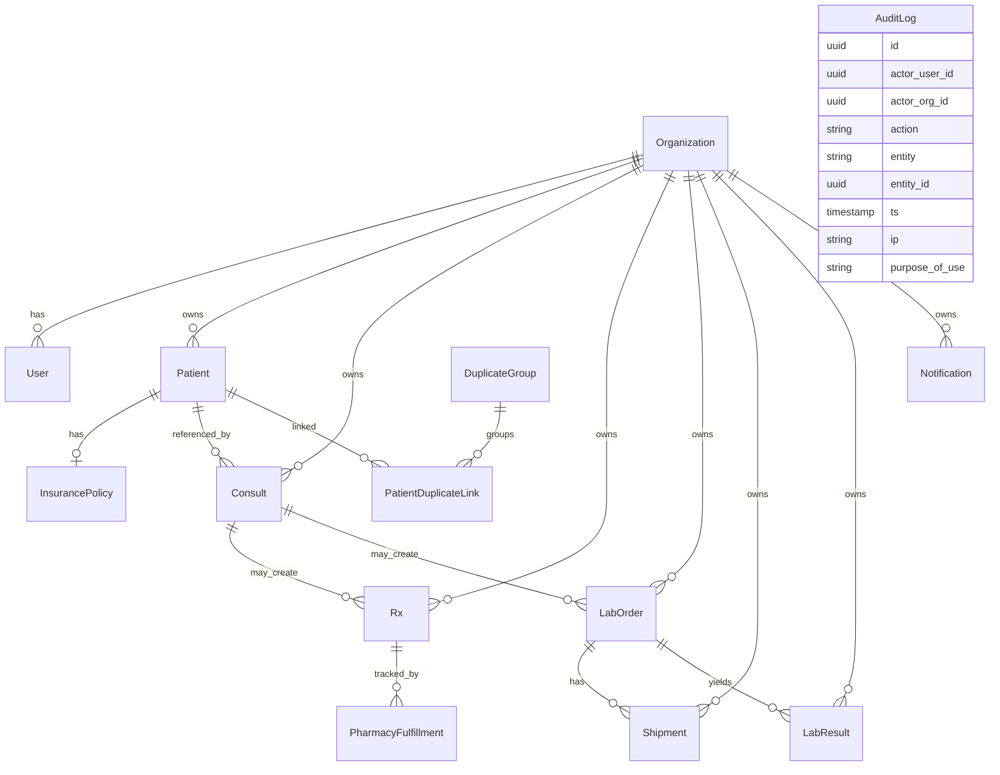
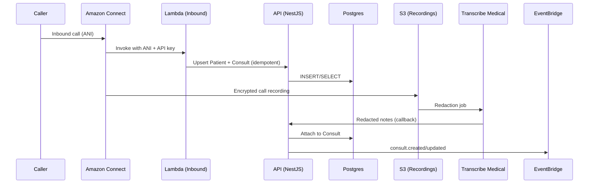
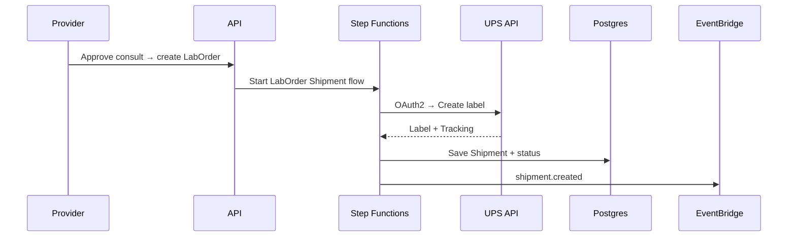
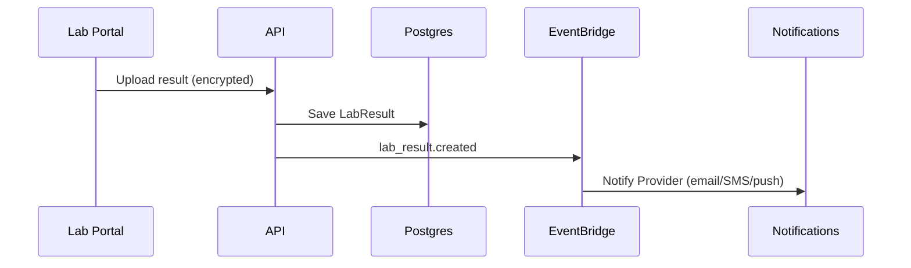
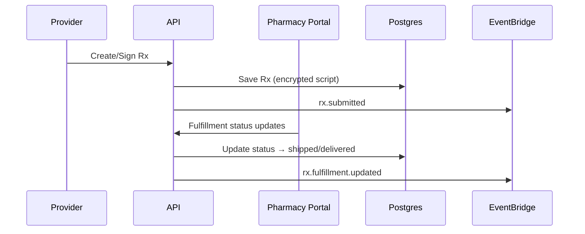

## Teleplatform System Specification (HIPAA/SOC 2‑aligned)

### Overview
A multi‑tenant telehealth SaaS for Providers/Doctors, Labs, Pharmacies, and Marketing Companies. The platform enforces HIPAA minimum‑necessary, SOC 2 control alignment, and ABAC guardrails. All PHI is encrypted in transit and at rest; audit is WORM.

### Tenants & Access Model
- Tenants: Provider Orgs, Lab Orgs, Pharmacy Orgs, Marketing Orgs.
- ABAC: org_id + role + purpose_of_use.
  - Marketer: consult status only (pass/fail, approved flag), lab shipping details (non‑PHI) only; never Rx/LabResult bodies.
  - Provider: full access to own patients/consults/Rx/LabResults.
  - Pharmacy: Rx for assigned pharmacy_org_id only; no LabResults.
  - Lab: LabOrders/Results for own org only; no Rx.

### Core User Journeys
- Marketer → Consult triage: intake (consent captured), provider decision (pass/fail), marketer sees status only.
- Provider consult: review intake, optionally request labs or issue Rx.
- Rx issuance: provider composes/signs; pharmacy fulfills; marketer sees approved boolean only.
- Lab order shipping (UPS): create label, ship kit, track events; marketer sees shipping only.
- Results routing: lab uploads result → provider notified → acknowledge/act.
- Pharmacy fulfillment status: pharmacy transitions queue → ready → shipped/delivered → notifications.

### AWS Reference Architecture
```mermaid
graph TD
  subgraph Edge
    WAF[WAF/Shield] --> ALB[ALB]
    WAF --> APIGW[API Gateway]
  end

  subgraph App[ECS Fargate / Lambda]
    ALB --> FE[Next.js Frontend]
    APIGW --> API[NestJS API (Fastify)]
    API --> SVC[Domain Services]
    SVC --> EB[EventBridge]
    SVC --> SQS[SQS Queues]
    SVC --> SFN[Step Functions]
    SVC --> RDS[(RDS Postgres)]
    SVC --> REDIS[(ElastiCache Redis)]
    SVC --> S3[(S3 Buckets)]
    SVC --> KMS[KMS CMKs]
  end

  subgraph Telephony
    CONNECT[Amazon Connect]
    CONNECT --> LAMBDA[Lambda (Inbound Handler)]
    LAMBDA --> S3REC[S3 Call Recordings]
    LAMBDA --> TRX[Transcribe Medical (PII Redaction)]
    LAMBDA --> EB
  end

  EB --> SQS
  EB --> SFN

  subgraph SecOps
    CT[CloudTrail]
    GD[GuardDuty]
    SH[Security Hub]
  end

  subgraph Observability
    CW[CloudWatch Logs/Metrics]
    OTL[OpenTelemetry + X-Ray]
  end

  API --> COGNITO[Cognito (OIDC/SAML SSO)]
  API --> CW
  API --> OTL
  S3 --> CW
  RDS --> CW
```

### Data Model (ERD + Tenancy)
- Multitenancy: every PHI‑bearing record linked to an owning `org_id`. ABAC enforces purpose‑of‑use at query time.
- Field‑level encryption for highly sensitive fields (e.g., insurance member id) using application‑level envelope encryption via KMS data keys.



### Workflows (Mermaid)
- Inbound call → consult record


- Lab kit shipment


- Result ingestion → provider notification


- Rx issuance → pharmacy portal


### API Surface (OpenAPI 3.1 Outline)
- Auth: POST /auth/login; POST /auth/refresh; POST /auth/logout
- Tenancy: GET/POST /orgs; GET/POST /users; POST /invites
- Patients: CRUD /patients; PHI‑safe search by tokenized fields
- Consults: POST/GET/LIST /consults; transitions: pass/fail/approved
- Rx: POST /rx; POST /rx/{id}/submit; GET /rx/{id}/status; GET /rx/{id}/script (provider/pharmacy only)
- Labs: POST /lab-orders; POST /lab-orders/{id}/submit; GET/POST /lab-orders/{id}/shipments; POST /lab-results (provider only reads)
- Shipping: POST /shipments; GET /shipments/{id}; POST /webhooks/ups
- Connect: POST /connect/inbound-call (idempotent); POST /connect/call-notes (redacted)
- Notifications: GET/POST /notifications (subscribe/prefs)
- Audits: GET /audit-logs (query by entity/purpose)
Notes: All list endpoints paginated; idempotency keys on mutating routes; marketer‑safe responses marked in schemas.

### Compliance Notes
- HIPAA minimum‑necessary enforced by ABAC; PHI never logged; structured log scrubbing and tokenization.
- BAAs with AWS and UPS. S3 buckets with Object Lock (WORM) for audit logs.
- Backups: RDS automated backups, PITR enabled; cross‑AZ; tested restores.
- DR: RTO 4h, RPO 15m; playbooks and tabletop exercises.

### Operational SLOs/SLIs
- API availability: 99.9% monthly; p95 latency: auth 200ms, CRUD 300ms, heavy queries 500ms.
- Inbound call provisioning: < 2s to create consult.
- Notification fan‑out: < 30s p95 from event emit.
- UPS webhook processing: < 60s p95 end‑to‑end.
- Error budgets tracked; autoscaling on CPU/RPS/queue depth.

### Rate Limits, Backpressure, Retries, DLQs
- Rate limits: per‑org + per‑IP, sliding window (e.g., 300 rpm/org; bursts allowed). Elevated for service accounts.
- Backpressure: shed load on hot endpoints; circuit breaker for external deps (UPS).
- Retries: exponential backoff (50ms→10s, jitter, max 5); idempotent handlers.
- DLQs: all async consumers with DLQ; automatic alarms and replay procedures.

### Security Defaults
- TLS 1.2+ everywhere; HSTS; CSRF and clickjacking protections; strict content security policies.
- Secrets in Secrets Manager with rotation; KMS CMKs for data encryption; private subnets for RDS/Redis.
- CloudTrail org‑wide; GuardDuty + Security Hub findings triage; WAF managed rules.

### Widgets & Must‑Haves (Execution Plan)
- P0 (MVP‑critical, Sprint 1–2)
  - Work Queue with SLA timers + auto‑escalation
  - Notification Center + Digest (email/SMS/in‑app)
  - Global Search w/ saved views (role‑aware)
  - Consent & Purpose‑of‑Use ledger
  - State/Licensure guard
  - Identity Proofing (IDV) + Insurance eligibility (270/271)
  - Duplicate/Poly‑provider alerts + merge tool
  - Audit Explorer (filters, export to WORM S3)
  - Security Center (MFA, allowlists, session kill)
  - API Keys & Webhooks Manager (per org)
  - Feature Flags Panel (env‑scoped)
- P1 (High‑value accelerators)
  - Video Visit (Chime SDK) + preflight
  - eRx Network status (Surescripts connector stub)
  - ePA / Prior Auth panel
  - Chain‑of‑Custody timeline (Lab)
  - Barcode/ZPL label print (Lab/Pharmacy)
  - UPS Exceptions board
  - Inventory & Kit manager (Lab)
  - Template Library (messages, SIG, consult macros)
  - Patient Portal (role‑limited)
  - Marketer TCPA/consent vault
- P2 (Ops excellence & insights)
  - Ops Command Center (TAT, pass rate, kits in transit, results aging)
  - Queue/Job Monitor (SQS/SFNs, DLQ replay UI)
  - Status/Maintenance Banner
  - Trust Center (BAA, SOC 2, uptime, subprocessors)
  - Policy Tester (RBAC/ABAC JWT sandbox)
  - Data Export Wizard (de‑id/full, watermark)
  - Localization + Timezones
  - Training/Sandbox mode (synthetic data)

### Traceability to Controls (HIPAA/SOC 2)
- Access Controls: Cognito + ABAC; least‑privilege IAM; MFA/SSO; device/IP allowlists.
- Audit & Monitoring: immutable audit logs (WORM S3); CloudTrail; GuardDuty; dashboards/alarms.
- Data Protection: KMS CMKs; field‑level encryption; tokenization; private subnets; TLS policies.
- Availability: multi‑AZ RDS; autoscaling; queues with DLQs; DR runbooks and exercises.

### Notes
- All diagrams are reference; see OpenAPI/Prisma tasks for contracts and schema specifics.
- All PHI fields must be explicitly allow‑listed before display/log; purpose‑of‑use modal gates visibility and is audited.

